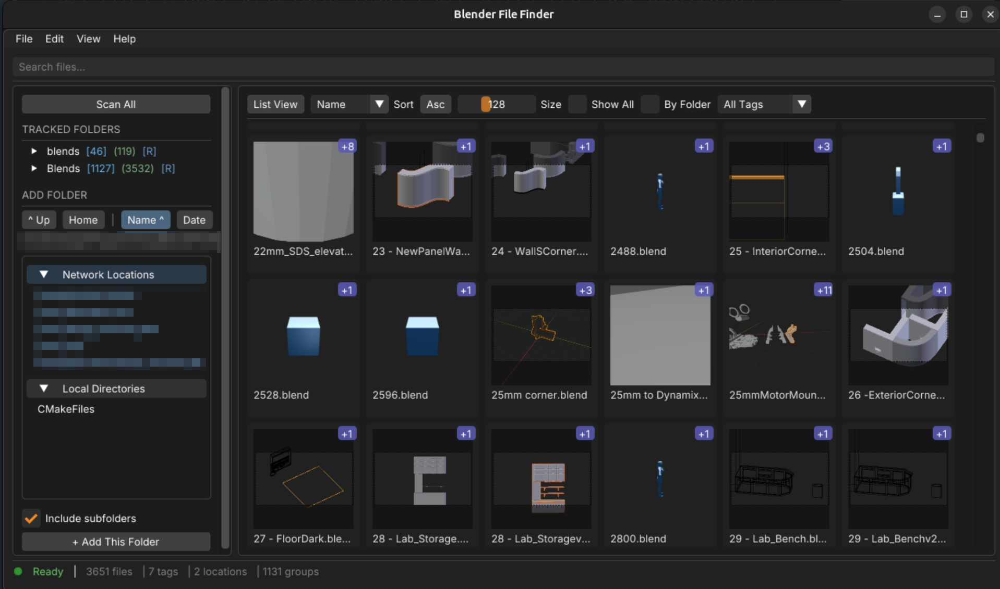

# Blender File Finder

BlenderFileFinder is a free Linux tool that scans your drives for .blend files, generates visual previews, and lets you tag/organize them effortlessly. No more getting lost meaningless file names.



A standalone application to browse, organize, and manage your .blend files with thumbnail previews and tagging support.

## Features

- Thumbnail previews extracted from .blend files
- Animated turntable previews on hover
- Tag-based organization
- Automatic version grouping (e.g., model_v01.blend, model_v02.blend)
- Search and filter by name or tags
- Grid and list view modes

## Prerequisites

- C++20 compatible compiler (GCC 10+, Clang 12+)
- CMake 3.16+
- OpenGL 3.3+
- GLFW 3.3+
- SQLite3
- Blender (optional, for generating rotation previews)

### Install Dependencies (Ubuntu/Debian)

```bash
sudo apt install build-essential cmake libglfw3-dev libsqlite3-dev libgl1-mesa-dev
```

### Install Dependencies (Fedora)

```bash
sudo dnf install gcc-c++ cmake glfw-devel sqlite-devel mesa-libGL-devel
```

### Install Dependencies (Arch)

```bash
sudo pacman -S base-devel cmake glfw sqlite mesa
```

## Building

```bash
git clone --recurse-submodules https://github.com/yourusername/BlenderFileFinder.git
cd BlenderFileFinder
mkdir build && cd build
cmake ..
make -j$(nproc)
```

For a release build with optimizations:

```bash
cmake -DCMAKE_BUILD_TYPE=Release ..
make -j$(nproc)
```

## Installation

### Option 1: Debian/Ubuntu Package (.deb)

Download and install the pre-built package:

```bash
sudo apt install ./blender-file-finder_1.0.0_amd64.deb
```

Or build your own .deb package:

```bash
./build-deb.sh 1.0.0
sudo apt install ./build/blender-file-finder_1.0.0_amd64.deb
```

This installs system-wide to `/usr/bin/blender-file-finder` with proper desktop integration.

To uninstall:

```bash
sudo apt remove blender-file-finder
```

### Option 2: User Installation (No Root Required)

Install to your home directory:

```bash
./install-desktop.sh
```

This will:
- Copy the binary to `~/.local/bin/`
- Install application icons
- Add a desktop entry so it appears in your application menu

To uninstall:

```bash
./uninstall-desktop.sh
```

## Running

```bash
./BlenderFileFinder
```

## Quick Start

1. Launch the application
2. In the sidebar, click "Add Location" to add a folder containing .blend files
3. Enable "Recursive" to include subfolders
4. Your files will be scanned and thumbnails will appear in the main view
5. Use the search bar to filter files, or click tags in the sidebar to filter by tag
6. Double-click a file to open it in Blender

Press **F1** in the application to open the built-in User Guide.

## Documentation

### Generate Doxygen Documentation

Install Doxygen:

```bash
# Ubuntu/Debian
sudo apt install doxygen graphviz

# Fedora
sudo dnf install doxygen graphviz

# Arch
sudo pacman -S doxygen graphviz
```

Create a Doxyfile and generate documentation:

```bash
cd /path/to/BlenderFileFinder

# Generate default Doxyfile (first time only)
doxygen -g

# Edit Doxyfile to set project options (optional)
# Key settings to change:
#   PROJECT_NAME = "Blender File Finder"
#   INPUT = src
#   RECURSIVE = YES
#   EXTRACT_ALL = YES
#   GENERATE_LATEX = NO

# Generate documentation
doxygen Doxyfile
```

Open the documentation in your browser:

```bash
xdg-open html/index.html
```

## Data Locations

- Database: `~/.local/share/BlenderFileFinder/database.db`
- Preview cache: `~/.cache/BlenderFileFinder/previews/`
- Scan cache: `~/.cache/BlenderFileFinder/`

## License

MIT License
